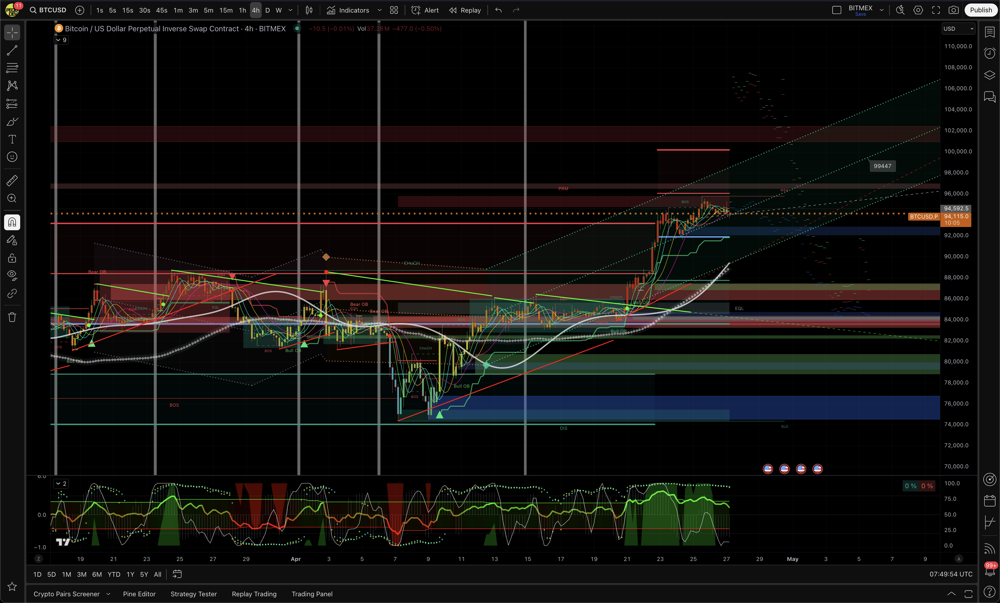
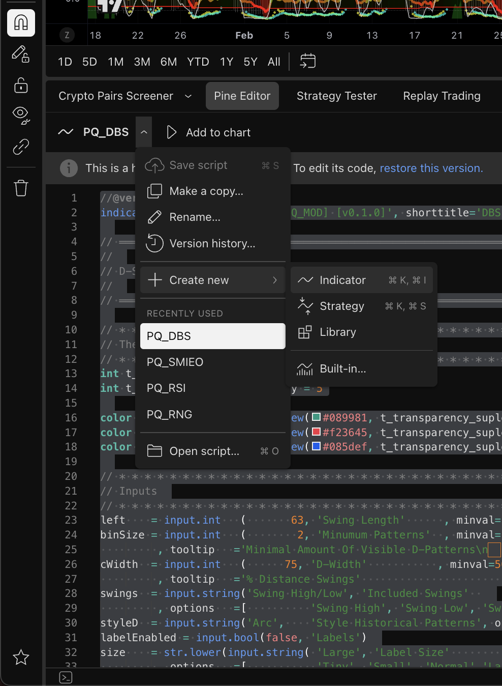
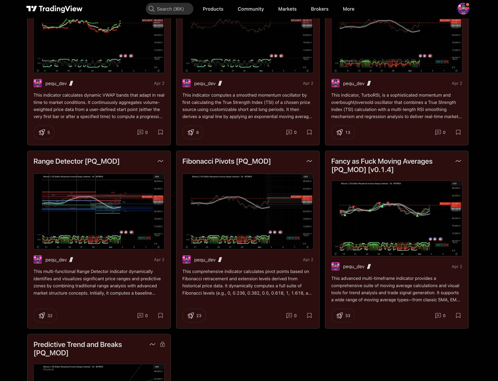

# PQ_MOD Indicators Suite

For nearly half a year I’ve been fine-tuning parameters and wrestling with some truly hellish mathematics to deliver a suite of TradingView scripts that you can parameterize on **any** candle timeframe. They consistently hit around **90% accuracy** in stable, technically-driven market cycles—and leverage non-standard analytical libraries and a serious mathematical engine under the hood.

---

## Table of Contents

1. [PQ_FIBS](#pq_fibs)  
2. [PQ_FTL](#pq_ftl)  
3. [PQ_MAVG](#pq_mavg)  
4. [PQ_RNG](#pq_rng)  
5. [PQ_RSI](#pq_rsi)  
6. [PQ_SMIEO](#pq_smieo)  
7. [PQ_VWAP](#pq_vwap)  
8. [Final Note](#final-note)  

---

## How to Add a New Pine Script to TradingView

Follow these steps to create and load your own custom indicator in the Pine Editor:

1. **Open the Pine Editor**  
   - At the bottom of TradingView, click **Pine Editor** to reveal the script editor pane.

2. **Expand the Script Menu**  
   - Next to the current script name (e.g. `PQ_DBS`), click the ▼ arrow.  
   - A context menu will appear with options like **Save script**, **Make a copy…**, **Version history…**, and **Create new**.

3. **Create a New Indicator**  
   - In that menu, choose **Create new → Indicator**  
     _(macOS shortcut: `⌘K, ⌘I`)_  
   - TradingView will open a fresh Pine Script template.

4. **Paste Your Code & Save**  
   - Delete the template code and paste in your own Pine Script.  
   - Click the floppy-disk icon (or press `⌘S`) to **Save script**.  
   - Give it a descriptive name (for example, `My_Custom_Indicator`).

5. **Add It to the Chart**  
   - With your new script still open, click **Add to chart** at the top of the Pine Editor.  
   - Your indicator will now appear on the active chart. 

---

## PQ_FIBS

**TL;DR**  
Overlays Fibonacci pivot points, retracement & extension levels, time zones, and optional volume/volatility signals so you can instantly spot key support/resistance areas and optimal entry/exit timing.

**Description**  
- Calculates a full suite of Fibonacci levels (0, 0.236, 0.382, 0.5, 0.618, 1, 1.618, negatives, etc.) using customizable deviation thresholds and depth settings.  
- Incorporates higher-timeframe OHLC data to refine pivot determination.  
- Draws Fibonacci time zones at sequence-based intervals.  
- Optional volume and volatility overlays highlight exhaustion or high-volatility bars.  
- Built-in alerts notify you when price crosses critical levels.  

---

## PQ_FTL

**TL;DR**  
Draws dynamic trendlines and channels based on recent highs/lows, highlights breakouts, and plots short-term forecasts to preview possible price paths.

**Description**  
- Detects swing highs/lows over a user-defined lookback.  
- Computes dynamic slopes via ATR, standard deviation, or linear regression.  
- Auto-selects the optimal lookback using multi-period correlation analysis.  
- Integrates an external forecasting library for price projections + variance bands.  
- Visualizes results in scatter or line plots, with extended trend channels.  
- Marks breakout events and optionally shows model stats (correlation, R², forecast extremes).  
- Alerts trigger on significant trendline breaches.  

---

## PQ_MAVG

**TL;DR**  
Overlays dozens of customizable moving averages—from intraday to monthly—fills the space between key averages as a “cloud,” and flags simple buy/sell signals on trend flips.

**Description**  
- Supports classic (SMA, EMA, WMA) and advanced (ALMA, JMA, FRAMA, etc.) MA types with full parameter control (period, offset, smoothing).  
- Plots on intraday, daily, weekly, and monthly charts.  
- Dynamic cloud fills instantly show faster vs. slower MA relationships.  
- ATR-based trend boundaries generate buy/sell signals and alerts on reversal.  
- Ideal for multi-timeframe trend confirmation.  

---

## PQ_RNG

**TL;DR**  
Automatically detects and colors tight price ranges, projects future bands, and—if enabled—overlays “smart money” concepts like swing/internal structure, order blocks, fair value gaps, equal highs/lows, premium/discount zones, MTF pivots, plus alerts on breaks.

**Description**  
- Computes a baseline price range via MA + ATR threshold over a custom period; draws and updates a range box & mean line when price stays inside.  
- Projects predictive range levels (upper/lower bounds) from extended ATR + multiplier.  
- Optional full suite of market-structure tools: swing/internal BOS & CHoCH, order blocks, fair value gaps, equal highs & lows, premium/discount zones, MTF levels.  
- Customizable styling, labels, and alert conditions for each concept.  
- Combines real-time structure analysis with predictive range dynamics.  

---

## PQ_RSI

**TL;DR**  
Blends a fast True Strength Index (TSI) oscillator, a multi-length RSI ensemble with stochastic smoothing, a candle heatmap based on regression deviation, plus overbought/oversold bands, signal lines, and an optional stats table.

**Description**  
- Computes TSI with user-defined short/long periods + signal EMA; scales linearly and logarithmically to highlight extremes.  
- Aggregates RSI over a configurable range to produce smoothed bullish/bearish channel bounds.  
- Calculates a regression line over a specified length; normalizes price deviation to a gradient for candle heat-mapping.  
- Overlays overbought/oversold zones, plotted channels, and reference lines at 80/50/20.  
- Optional table displays key metrics (% overbought/oversold, etc.).  

---

## PQ_SMIEO

**TL;DR**  
A straightforward True Strength Index (TSI) + EMA signal plot with the TSI–signal difference shown as a histogram for quick momentum assessment.

**Description**  
- Calculates TSI on your chosen source with customizable short/long periods.  
- Derives an EMA-based signal line.  
- Plots TSI & signal as translucent circles; oscillator (TSI–signal) as a histogram.  
- Helps you spot overbought/oversold conditions and momentum shifts at a glance.  

---

## PQ_VWAP

**TL;DR**  
Responsive VWAP with dynamically resetting volume‐weighted average price and volatility bands—always showing a contextual “fair value” and its range.

**Description**  
- Continuously aggregates volume-weighted price from a chosen start (first bar or a specific time).  
- Computes cumulative VWAP (pvwap) and its volatility via volume-weighted variance.  
- Scales standard deviation by a multiplier to form upper & lower bands.  
- Event-triggered resets (periodic, new HH/LL, trend change, external event) reinitialize VWAP for maximum responsiveness.  
- Plots VWAP and bands as circle markers directly on the price chart.  

---

## Final Note

These indicators took off immediately—over **30** installs in the first day alone—until they were quietly banned. (Let’s just say their effectiveness spoke for itself, yolo)  

